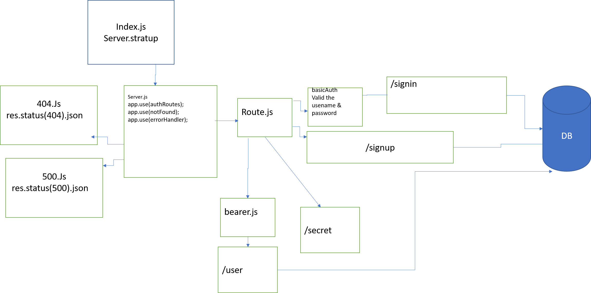
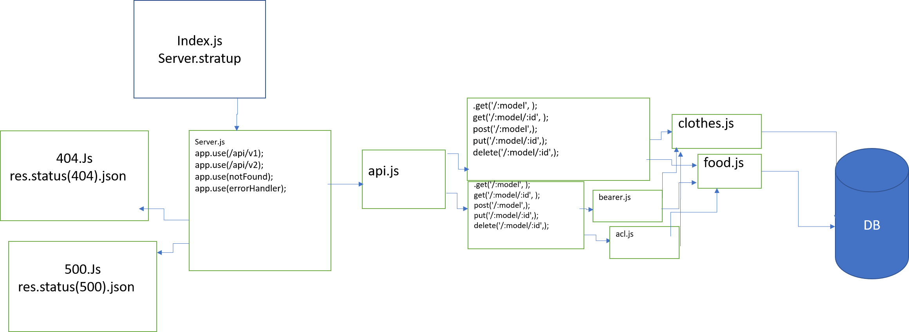
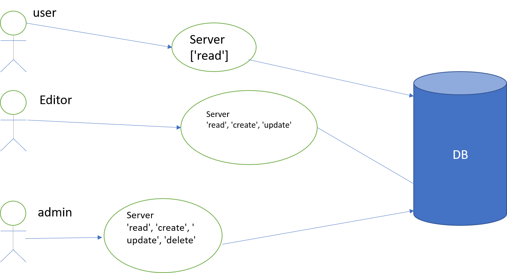

# auth-api

## Author: areenjaradat

### Links and Resources

- [ci/cd](https://github.com/areenjaradat/bearer-auth/actions) (GitHub Actions)

- [Repo link](https://github.com/areenjaradat/bearer-auth)

- [PR link](https://github.com/areenjaradat/bearer-auth/pulls)

- [main Deployed heroku](https://areen-auth-api-server.herokuapp.com)

### Setup

#### `.env` requirements

#### `express` requirements

#### `mongoose` requirements

#### `@code-fellows/supergoose` requirements

#### `base-64 bcrypt`

#### `jsonwebtoken`

#### How to initialize/run your application (where applicable)

- `node server.js`

#### Tests

- How do you run tests?
   `npm test`

#### UML

